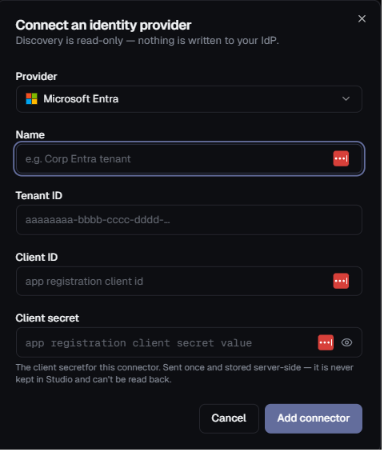
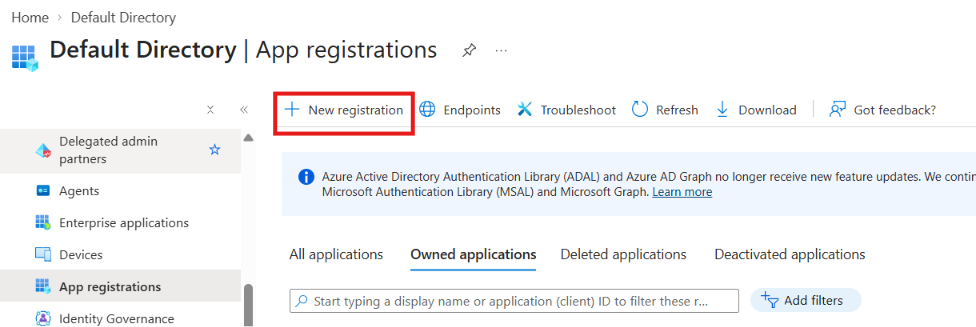
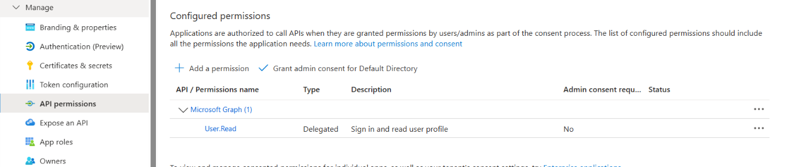

# Microsoft Entra Connector Setup

This guide explains how to configure **Microsoft Entra ID** for the Highflame Registry connector.



---

## Step 1 — Create the App Registration

Go to:

**Azure Portal → Microsoft Entra ID → App registrations → New registration**



For the customer setup, use:

```text
Name:
Highflame Discovery

Supported account types:
Any Entra ID Tenant + Personal Microsoft accounts
```

No **Redirect URI** is required for this connector because it uses a client credential/service-to-service flow.

Click **Register**.

---

## Step 2 — Get Tenant ID and Client ID

After registration, open the application's **Overview** page.

You will see:

```text
Application (client) ID
Directory (tenant) ID
```

Use these values in the Highflame connector:

```text
Name       = Highflame Discovery
Tenant ID  = <Directory (tenant) ID>
Client ID  = <Application (client) ID>
```

> **Important:** Do not use the **Object ID** as the Client ID.

---

## Step 3 — Add the Required API Permissions

Go to:

**App registrations → `<your application>` → API permissions → Add a permission**



Select:

**Microsoft Graph**

Add the following **three permissions by default**:

```text
Microsoft Graph
├── AgentIdentity.Read.All  → Application
├── Application.Read.All    → Application
└── User.Read               → Delegated
```

### Required Permissions

| Permission               | Type        | Purpose                                                    |
| ------------------------ | ----------- | ---------------------------------------------------------- |
| `AgentIdentity.Read.All` | Application | Read Entra Agent Identities                                |
| `Application.Read.All`   | Application | Read application registrations and enterprise applications |
| `User.Read`              | Delegated   | Read the signed-in user's basic profile information        |

> **Important:** `AgentIdentity.Read.All` and `Application.Read.All` must be configured as **Application permissions**. `User.Read` must be configured as a **Delegated permission**, as shown above.

After adding all three permissions, click:

**Add permissions**

The permissions should appear under **Microsoft Graph**:

```text
Microsoft Graph (3)

✓ AgentIdentity.Read.All    Application
✓ Application.Read.All      Application
✓ User.Read                 Delegated
```

### Grant Admin Consent

After adding the permissions, click:

**Grant admin consent for `<your tenant>`**

Confirm the consent request.

After successful consent, verify that the permissions show as granted:

```text
Microsoft Graph

AgentIdentity.Read.All
    Type: Application
    Status: Granted ✓

Application.Read.All
    Type: Application
    Status: Granted ✓

User.Read
    Type: Delegated
    Status: Granted ✓
```

These three permissions should be configured as the **default permissions for the Highflame Entra connector**.

---

## Step 4 — Grant Admin Consent

After adding the required application permissions, go to:

**API permissions → Grant admin consent for `<your tenant>`**

Click **Yes** to confirm.

The permission status should then show:

```text
Status:
Granted for <your tenant>
```

> **Important:** Application permissions generally require administrator consent.

---

## Step 5 — Create the Client Secret

Go to:

**Certificates & secrets → Client secrets → New client secret**

Use a descriptive name:

```text
Description:
Highflame Discovery

Expiration:
Choose according to your organization's secret-rotation policy
```

Click **Add**.

After creating the secret, Azure will display:

```text
Value
Secret ID
Expires
```

### Copy the Client Secret Value

The Highflame connector requires the **Value**, not the Secret ID.

```text
Client secret
├── Value       ← USE THIS
└── Secret ID   ← DO NOT USE THIS
```

> **Important:** The client secret value is only displayed when the secret is created. Copy and securely store it immediately.

---

## Step 6 — Configure the Highflame Connector

Open:

**Highflame → Registry → Connections → Add Connector**

Select:

```text
Provider:
Microsoft Entra
```

Fill in the connector:

```text
Name:
Highflame Discovery

Tenant ID:
xxxxxxxx-xxxx-xxxx-xxxx-xxxxxxxxxxxx

Client ID:
xxxxxxxx-xxxx-xxxx-xxxx-xxxxxxxxxxxx

Client secret:
<client secret VALUE>
```

Then click:

**Add connector**

---

## Connector Configuration Summary

| Highflame Field   | Microsoft Entra Value   |
| ----------------- | ----------------------- |
| **Provider**      | Microsoft Entra         |
| **Name**          | Customer-defined name   |
| **Tenant ID**     | Directory (tenant) ID   |
| **Client ID**     | Application (client) ID |
| **Client secret** | Client secret **Value** |

---

## Configuration Flow

```text
Microsoft Entra ID
        │
        ▼
App Registration
        │
        ├── Tenant ID
        ├── Client ID
        ├── API Permissions
        └── Client Secret
                │
                ▼
        Highflame Registry
                │
                ▼
        Microsoft Entra Connector
                │
                ▼
        Discovery / Inventory
```

---

## Security Notes

* Use **Application permissions** for the service-to-service connector.
* Grant only the permissions required by the connector.
* Do not use the **Object ID** in place of the Client ID.
* Do not use the **Secret ID** as the client secret.
* Store the client secret securely.
* Follow your organization's secret rotation policy.
* Never commit the client secret to source control.
