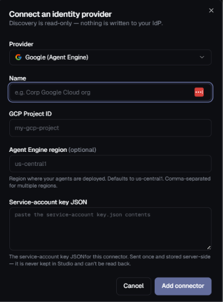
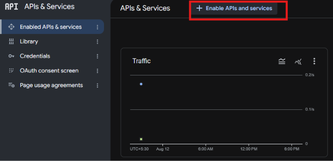
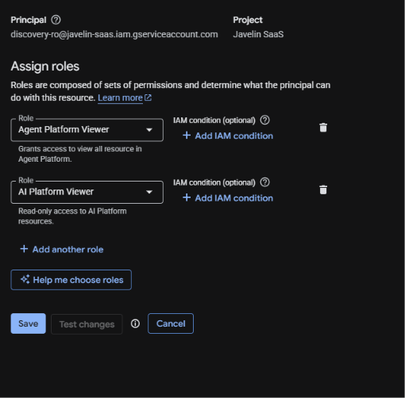

# Google Agent Engine Connector Setup

This guide explains how to configure **Google Agent Engine** for the Highflame Registry connector.



---

## Step 1 — Create or Select a GCP Project

Go to:

**Google Cloud Console → Project selector**

Create a new project or select the existing project that contains your **Agent Engine deployments**.

For example:

```text
Project name:
Highflame Agent Discovery

Project ID:
highflame-agent-discovery
```

> **Important:** The GCP Project ID is required by the Highflame connector. Use the **Project ID**, not the Project Name or Project Number.

---

## Step 2 — Enable the Required APIs

Open:

**Google Cloud Console → APIs & Services → Library**



Enable the APIs required for Agent Engine discovery.

---

## Step 3 — Create the Dedicated Read-Only Service Account

**Dedicated read-only SA key** (this is what you paste into Studio — least privilege):

```bash
gcloud iam service-accounts create discovery-ro \
  --display-name="Highflame discovery (read-only)"
```

This creates the service account:

```text
discovery-ro@<PROJECT>.iam.gserviceaccount.com
```

---

## Step 4 — Grant the Required Permissions

Grant the service account the required read-only Vertex AI role:

```bash
gcloud projects add-iam-policy-binding <PROJECT> \
  --member="serviceAccount:discovery-ro@<PROJECT>.iam.gserviceaccount.com" \
  --role="roles/aiplatform.viewer"
```

`roles/aiplatform.viewer` covers `reasoningEngines.list` and `reasoningEngines.get` — all the connector needs.




---

## Step 5 — Create the Service Account Key

Create a JSON key for the read-only service account:

```bash
gcloud iam service-accounts keys create discovery-ro.json \
  --iam-account=discovery-ro@<PROJECT>.iam.gserviceaccount.com
```

This creates:

```text
discovery-ro.json
```

The contents of this file are pasted into the **Service-account key JSON** field in Studio.

### ⚠️ Protect the JSON key

The downloaded JSON file contains credentials for the service account.

Do not:

* Commit it to Git.
* Upload it to public storage.
* Share it in Slack or email.
* Add it directly to source control.

Store it securely.

---

## Step 6 — Get the GCP Project ID

Go to:

**Google Cloud Console → Project selector → Project information**

Copy:

```text
Project ID
```

Example:

```text
highflame-agent-discovery
```

Use the **Project ID** in the Highflame connector.

---

## Step 7 — Identify the Agent Engine Region

The Highflame connector provides:

```text
Agent Engine region
```

Enter the region where your Agent Engine resources are deployed.

For example:

```text
us-central1
```

If multiple regions are supported, provide them as comma-separated values:

```text
us-central1,us-east4
```

> **Important:** Make sure the region matches the region where the customer's Agent Engine resources are deployed.

---

## Step 8 — Configure the Highflame Connector

Open:

**Highflame → Registry → Connections → Add Connector**

Select:

```text
Provider:
Google (Agent Engine)
```

Configure the fields:

```text
Name:
Google Agent Engine

GCP Project ID:
<your GCP Project ID>

Agent Engine region:
<your Agent Engine region>

Service-account key JSON:
<paste the complete contents of discovery-ro.json>
```

Example:

```text
Provider:
Google (Agent Engine)

Name:
Google Agent Engine

GCP Project ID:
highflame-agent-discovery

Agent Engine region:
us-central1

Service-account key JSON:
{
  "type": "service_account",
  "project_id": "highflame-agent-discovery",
  "private_key_id": "...",
  "private_key": "...",
  "client_email": "...",
  ...
}
```

Then click:

**Add connector**

---

## Step 9 — Sync the Connector

After adding the connector, select:

**Sync now**

The connector will use the read-only service account to discover deployed Agent Engine reasoning engines.

The discovered reasoning engines should appear in the **Agents** registry as:

```text
Type:
agent

Segment:
External
```

---

## Connector Configuration Summary

| Highflame Field              | GCP Value                                        |
| ---------------------------- | ------------------------------------------------ |
| **Provider**                 | Google (Agent Engine)                            |
| **Name**                     | Customer-defined name                            |
| **GCP Project ID**           | GCP Project ID containing Agent Engine resources |
| **Agent Engine region**      | Region where Agent Engine resources are deployed |
| **Service-account key JSON** | Complete contents of `discovery-ro.json`         |

---

## Configuration Flow

```text
Google Cloud
      │
      ▼
GCP Project
      │
      ├── Vertex AI API
      │
      ├── Agent Engine
      │      └── Reasoning Engines
      │
      └── Service Account
              │
              ├── discovery-ro
              │
              ├── roles/aiplatform.viewer
              │
              └── discovery-ro.json
                      │
                      ▼
              Highflame Registry
                      │
                      ▼
             Google Agent Engine
                  Connector
                      │
                      ▼
                   Sync now
                      │
                      ▼
              Agents Registry
                      │
                      └── External
```

---

## Security Notes

* Use a dedicated `discovery-ro` service account for Highflame discovery.
* Grant only the permissions required for discovery.
* Use `roles/aiplatform.viewer` for read-only access.
* Do not use a project Owner or Editor account.
* Protect the `discovery-ro.json` key.
* Never commit the JSON key to source control.
* Rotate credentials according to your organization's security policy.

---