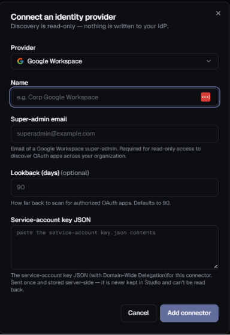
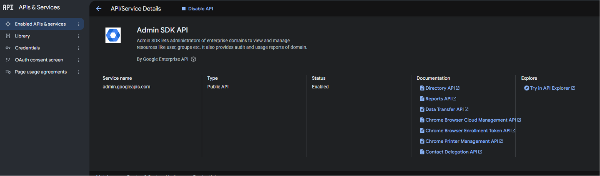

# Google Workspace Connector Setup

This guide explains how to configure **Google Workspace** for the Highflame Registry connector.



---

## Step 1 — Enable the Admin SDK API

Go to:

**Google Cloud Console → APIs & Services → Library**

Search for and enable:

```text
Admin SDK API
admin.googleapis.com
```

Enable the API in the GCP project that owns the service account used by the Highflame connector.



---

## Step 2 — Get the Service Account OAuth Client ID

Go to:

**Google Cloud Console → IAM & Admin → Service Accounts**

Select the service account that will be used for Highflame discovery.

### Get the JSON key

1. Click **Keys** at the top.
2. Click **Add key**.
3. Select **Create new key**.
4. Select **JSON**.
5. Click **Create**.

The JSON key will be downloaded automatically. You will use the **complete contents of this JSON file** in the Highflame connector's **Service-account key JSON** field.

From the service-account JSON, find the numeric:

```json
{
  "client_id": "123456789012345678901"
}
```

Copy the `client_id` value.

> **Important:** Use the numeric OAuth `client_id`. Do not use the service-account email, Project ID, or private key ID.

---

## Step 3 — Configure Domain-Wide Delegation

Sign in to:

**Google Admin Console → https://admin.google.com**

You must have **Google Workspace Super Admin** access.

Go to:

**Security → Access and data control → API controls → Domain-wide delegation → Manage Domain Wide Delegation → Add new**

Enter:

```text
Client ID:
<service-account OAuth client ID>
```

Add the following OAuth scopes:

```text
https://www.googleapis.com/auth/admin.directory.user.readonly
https://www.googleapis.com/auth/admin.directory.user.security
```

Click:

**Authorize**

---

## Step 4 — Configure the Highflame Connector

Open:

**Highflame → Registry → Connections → Add Connector**

Select:

```text
Provider:
Google Workspace
```

Configure:

```text
Name:
Google Workspace

Super-admin email:
<Google Workspace super-admin email>

Lookback (days):
90

Service-account key JSON:
<paste the complete service-account JSON>
```


Then click:

**Add connector**

> **Important:** Paste the complete contents of the service-account JSON key into the **Service-account key JSON** field.

---

## Step 5 — Sync the Connector

After adding the connector, select:

**Sync now**

The connector uses the service account with **Domain-Wide Delegation** to access the Google Workspace environment in read-only mode and discover the supported OAuth applications.

---

## Connector Configuration Summary

| Highflame Field | Value |
|---|---|
| **Provider** | Google Workspace |
| **Name** | Customer-defined name |
| **Super-admin email** | Google Workspace admin to impersonate |
| **Lookback (days)** | Number of days to scan |
| **Service-account key JSON** | Complete service-account JSON |

---

## Security Notes

- Use a dedicated service account for Highflame discovery.
- Grant only the required read-only OAuth scopes.
- Protect the service-account JSON key.
- Never commit the JSON key to source control.
- Do not share the JSON key through Slack or email.
- Rotate credentials according to your organization's security policy.