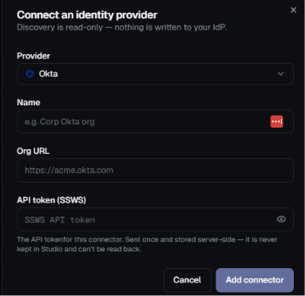

# Okta Connector Setup

This guide explains how to configure **Okta** for the Highflame Registry connector.



---

## Step 1 — Create an Okta Organization

Create or use an existing Okta organization.

The Okta organization URL will look like:

```text
https://<your-org>.okta.com
```

You will need this URL when configuring the Highflame connector.

---

## Step 2 — Create an SSWS API Token

Sign in to the **Okta Admin Console**.

Go to:

**Security → API → Tokens**

Create a new API token.

Use a descriptive name such as:

```text
Highflame Discovery
```

The token is used by Highflame to access the Okta APIs for read-only discovery.

> **Important:** Copy the token when it is created and store it securely. The token is a secret and should not be committed to source control or shared through Slack/email.

---

## Step 3 — Configure the Required Access

For **OAuth application discovery**, a read-only Okta administrator token is sufficient.

For **AI agent discovery**, the Okta organization must be subscribed to **Okta for AI Agents**, and the API token must have the required AI-agents read permission.

If the AI-agent capability is not available or the required permission is not present, the connector will still discover OAuth applications and will operate in **apps-only** mode.

> **Note:** Apps-only discovery is an expected fallback and is not considered a connector failure.

---

## Step 4 — Configure the Highflame Connector

Open:

**Highflame → Registry → Connections → Add Connector**

Select:

```text
Provider:
Okta
```

Configure the fields:

```text
Name:
<customer Okta organization>

Org URL:
https://<your-org>.okta.com

API token (SSWS):
<paste the Okta API token>
```


Then click:

**Add connector**

---

## Connector Configuration

The connector stores the following non-secret configuration:

```json
{
  "org_url": "https://<your-org>.okta.com",
  "discover_oauth_apps": true,
  "discover_ai_agents": true
}
```

The SSWS API token is stored separately as the connector secret.

---

## Step 5 — Sync the Connector

After adding the connector, trigger:

**Sync now**

The discovery service connects to the configured Okta organization and discovers the supported resources.

The sync response reports what was discovered.

Discovered resources are added to the ZeroID **discovered** inventory with:

```text
Origin:
okta
```

---

## Connector Configuration Summary

| Highflame Field | Value |
|---|---|
| **Provider** | Okta |
| **Name** | Customer-defined name |
| **Org URL** | `https://<your-org>.okta.com` |
| **API token (SSWS)** | Okta SSWS API token |
| **OAuth app discovery** | Enabled |
| **AI agent discovery** | Enabled when supported by the Okta organization |

---

## Security Notes

- Use a dedicated Okta API token for Highflame discovery.
- Use read-only access for OAuth application discovery.
- Do not share the SSWS token.
- Never commit the SSWS token to source control.
- Do not include the token in logs or screenshots.
- Store the token securely.
- Rotate the token according to your organization's security policy.
- AI-agent discovery requires the Okta organization to be subscribed to **Okta for AI Agents** and the appropriate read permission.
- If AI-agent access is unavailable, the connector can operate in **apps-only** mode.