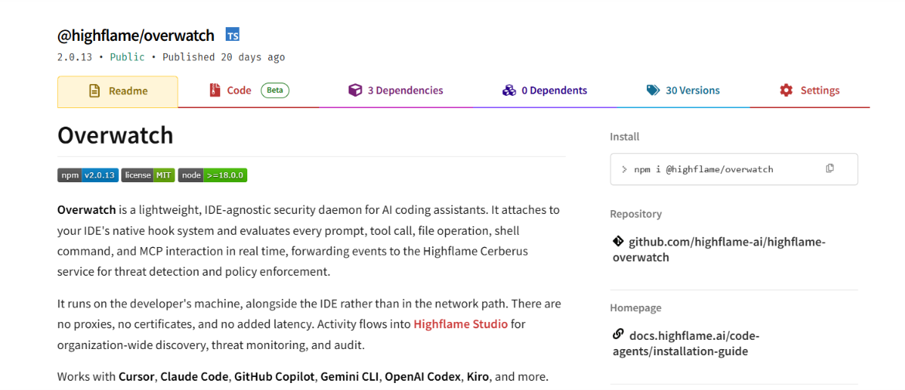

# Agent Protection Setup

This guide explains how to install **Overwatch** from npm and connect it to
Highflame. One install on the machine is enough: Overwatch detects every
supported coding agent and monitors them together.

Works with **Cursor**, **Claude Code**, **GitHub Copilot**, **Gemini CLI**,
**OpenAI Codex**, and **Kiro**.

The package is [`@highflame/overwatch`](https://www.npmjs.com/package/@highflame/overwatch).

You do not create an API key, and you do not run a separate sign-up command.
`overwatch start` opens a browser to Highflame Studio and signs you in there.

---

## Step 1 — Install Overwatch

Requires **Node.js 18** or newer.

```bash
npm install -g @highflame/overwatch
```


Confirm the CLI is on your PATH:

```bash
overwatch --help
```

The matching native scanner for your OS (macOS, Linux, or Windows; x64 or ARM64)
is installed automatically.

---

## Step 2 — Start Overwatch

```bash
overwatch start
```

On first run (or after the session expires) it opens a browser to Studio:

[https://studio.highflame.ai](https://studio.highflame.ai)

Sign in with your Highflame account in that window. If you already have an
account, that is all. If you do not, create one on that page — there is nothing
to sign up for in the CLI.

After login, Overwatch attaches to every supported agent it finds on the
machine. Later `overwatch start` skips the browser if you are still signed in.

Confirm:

```bash
overwatch whoami
overwatch status
overwatch hooks
```

You should see your Studio email, that Overwatch is running, and hooks for the
agents installed on this machine. You do not run a separate install per agent.

Restart any coding agent that was already open so it picks up the hooks.

---

## Step 3 — Verify the Connection

Use any attached agent (Cursor, Claude Code, Copilot, and so on), send a prompt,
then check Studio:

```text
Code Agents → Sessions/Events
```

A normal prompt should go through. A prompt that violates a Studio policy in
**enforce** mode is blocked on the machine before it reaches the model.

To send an agent's *model* traffic through the Highflame AI Gateway instead of
hooks, see [`../overwatch-gateway-mode/`](../overwatch-gateway-mode/).

---

## Connector Configuration Summary

| Field | Value |
| --- | --- |
| **Package** | `@highflame/overwatch` (npm) |
| **Install** | `npm install -g @highflame/overwatch` |
| **Login** | Happens in the browser on first `overwatch start` |
| **Coverage** | Every supported agent detected on the machine |

---

## Security Notes

* Sign in with your own Highflame user. Do not share a Studio session across
  developers.
* One daemon covers every agent on the machine. You do not install Overwatch
  once per IDE.
* Rotate access by signing out (`overwatch logout`) and removing the global
  package if the machine should no longer be protected.
