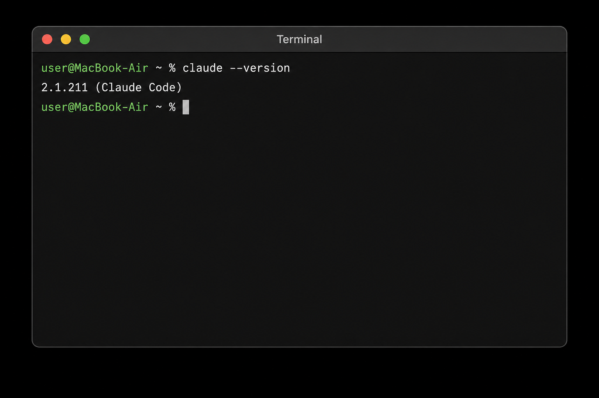

# Claude Code with Highflame AI Gateway

## Overview

This cookbook shows you how to configure **Claude Code** to use the **Highflame AI Gateway**.

With this setup, Claude Code requests are routed through Highflame instead of directly to the underlying model provider.

```text
┌──────────────────────┐
│     Claude Code      │
│    Customer Device   │
└──────────┬───────────┘
           │
           │ Anthropic API
           ▼
┌──────────────────────────┐
│   Highflame AI Gateway   │
│                          │
└──────────┬───────────────┘
           │
           ▼
┌──────────────────────────┐
│       AI Model           │
│    Configured in         │
│    Highflame Gateway     │
└──────────────────────────┘
```

---

# 1. Install Claude Code

Install Claude Code using the official installation method for your operating system.

Verify the installation:

```bash
claude --version
```



---

# 2. Get Your Highflame Gateway Details

Log in to **Highflame Studio**:

[Highflame Studio](https://studio.highflame.ai)

You will need three values to configure Claude Code:

* **LLM Base URL**
* **API Key**
* **Model**

## 2.1 Get the LLM Base URL

After logging in:

1. Open **AI Gateway**.
2. Select **LLM Providers** from the left navigation.
3. At the top of the **Providers** page, locate **LLM Base URL**.
4. Copy the displayed URL.

For example:

```text
https://gateway.highflame.ai/llm/v1
```

Use this value as the `ANTHROPIC_BASE_URL` in your Claude Code configuration.

> **Note:** Use the LLM Base URL displayed in your Highflame Studio environment. The URL may differ between environments.

## 2.2 Create an API Key

1. In Highflame Studio, open **AI Gateway → API Keys**.
2. Click **Create API Key**.
3. Create a new API key.
4. Copy the API key and store it securely.


The API key is used to authenticate Claude Code requests with the Highflame AI Gateway.

> **Important:** Do not add the actual API key directly to source code or commit it to Git.

## 2.3 Identify the Model

Use the model identifier configured and available through your Highflame AI Gateway.

For example:

```text
anthropic/claude-sonnet-4-6
```

Use the exact model identifier configured in your Highflame environment.

## 2.4 Information You Should Have

Before continuing to the Claude Code configuration, you should have:

| Value                  | Example                               |
| ---------------------- | ------------------------------------- |
| Highflame LLM Base URL | `https://gateway.highflame.ai/llm/v1` |
| Highflame API Key      | `YOUR_HIGHFLAME_API_KEY`              |
| Model                  | `anthropic/claude-sonnet-4-6`         |

You will use these values in the next step to configure Claude Code.

---

# 3. Configure Claude Code

Claude Code stores user-level configuration in:

```text
~/.claude/settings.json
```

Open the configuration file:

```bash
nano ~/.claude/settings.json
```

Add the Highflame configuration under the `env` section:

```json
{
  "env": {
    "ANTHROPIC_BASE_URL": "https://YOUR-HIGHFLAME-GATEWAY/llm/v1",
    "ANTHROPIC_CUSTOM_HEADERS": "x-highflame-apikey: YOUR_HIGHFLAME_API_KEY",
    "ANTHROPIC_MODEL": "YOUR_MODEL"
  }
}
```

> **Note:** If `settings.json` already contains other settings, such as `hooks`, do not remove them. Add the `env` section to the existing configuration.

---

# 4. Replace the Configuration Values

Replace:

```text
YOUR_MODEL
```

with the model configured in your Highflame Gateway.

For example:

```json
"ANTHROPIC_MODEL": "anthropic/claude-sonnet-4-6"
```

Replace:

```text
https://YOUR-HIGHFLAME-GATEWAY/llm/v1
```

with your Highflame Gateway endpoint.

For example:

```json
"ANTHROPIC_BASE_URL": "https://gateway.highflame.ai/llm/v1"
```

Replace:

```text
YOUR_HIGHFLAME_API_KEY
```

with the API key generated from Highflame Studio.

The final configuration might look like:

```json
{
  "env": {
    "ANTHROPIC_BASE_URL": "https://gateway-dev.highflame.dev/llm/v1",
    "ANTHROPIC_CUSTOM_HEADERS": "x-highflame-apikey: YOUR_HIGHFLAME_API_KEY",
    "ANTHROPIC_MODEL": "anthropic/claude-sonnet-4-6"
  }
}
```

### Existing Claude Code configuration

If your `settings.json` already contains other configuration, keep it.

For example:

```json
{
  "env": {
    "ANTHROPIC_BASE_URL": "https://gateway-dev.highflame.dev/llm/v1",
    "ANTHROPIC_CUSTOM_HEADERS": "x-highflame-apikey: YOUR_HIGHFLAME_API_KEY",
    "ANTHROPIC_MODEL": "anthropic/claude-sonnet-4-6"
  },
  "hooks": {
    ...
  }
}
```

The `env` section configures the environment variables used by Claude Code.

---

# 5. Save and Validate the Configuration

If you are using `nano`, save the file:

```text
Ctrl + O
Enter
Ctrl + X
```

Validate that the JSON is correctly formatted:

```bash
python3 -m json.tool ~/.claude/settings.json > /dev/null
```

If the command produces no output, the JSON is valid.

> **Important:** Make sure there is no trailing comma after the last property in the `env` section.

For example, this is invalid:

```json
{
  "env": {
    "ANTHROPIC_MODEL": "anthropic/claude-sonnet-4-6",
  }
}
```

This is valid:

```json
{
  "env": {
    "ANTHROPIC_MODEL": "anthropic/claude-sonnet-4-6"
  }
}
```

---

# 6. Start Claude Code

Once the configuration is ready:

```bash
claude
```

Claude Code will use:

```text
Model:
YOUR_MODEL

Provider:
Highflame AI Gateway

Endpoint:
YOUR-HIGHFLAME-GATEWAY/llm/v1
```

Requests will now follow:

```text
Claude Code
     ↓
Highflame AI Gateway
     ↓
Configured Model
```

---

# 7. Verify the Connection

Inside Claude Code, run a simple request:

```text
Hello, confirm that the connection is working.
```

Then check **Highflame Observatory**.

You should see the request being received by Highflame.

A successful request confirms:

```text
Claude Code
     ↓
Highflame API authentication
     ↓
Highflame Gateway
     ↓
Model routing
     ↓
Model response
     ↓
Claude Code
```

If the request fails with an authentication error, verify that the Highflame API key is being sent using the required:

```text
x-highflame-apikey
```

header.

---

# 8. Summary

After completing the setup, customers can use Claude Code normally.

The only difference is where requests are routed:

```text
Before:

Claude Code → Anthropic


After:

Claude Code → Highflame AI Gateway → Model Provider
```

Highflame becomes the centralized gateway between Claude Code and the configured AI models while the customer continues using the normal Claude Code experience.
