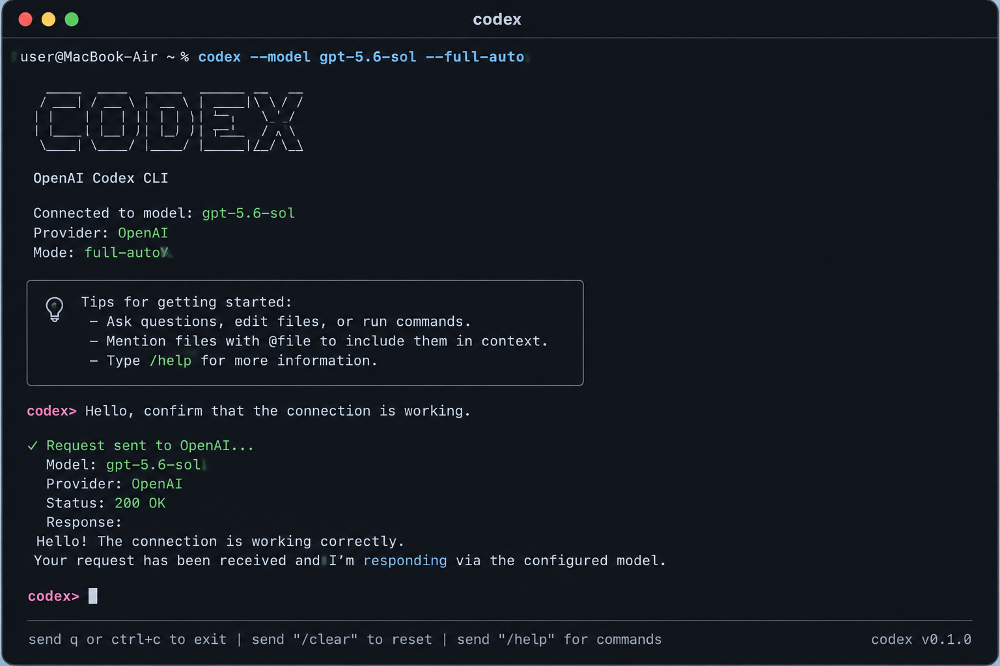
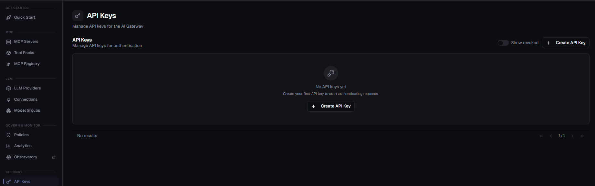

# OpenAI Codex with Highflame AI Gateway

## Overview

This cookbook shows how to configure **OpenAI Codex CLI** to use the **Highflame AI Gateway**.

With this setup, Codex requests are routed through Highflame instead of directly to the underlying model provider.

```text
┌──────────────────┐
│   Codex CLI      │
│  Customer Device │
└────────┬─────────┘
         │
         │ Responses API
         ▼
┌──────────────────────────┐
│   Highflame AI Gateway   │
│                          │      │
└────────┬─────────────────┘
         │
         ▼
┌──────────────────────────┐
│       AI Model           │
│    Configured in         │
│    Highflame Gateway     │
└──────────────────────────┘
```

---

# 1. Install Codex

Install Codex CLI:

```bash
curl -fsSL https://chatgpt.com/codex/install.sh | sh
```

Verify the installation:

```bash
codex --version
```



---

# 2. Get Your Highflame Gateway Details

Log in to **Highflame Studio**:

[Highflame Studio](https://studio.highflame.ai)

You will need two values to configure Codex:

* **LLM Base URL**
* **API Key**

## 2.1 Get the LLM Base URL

After logging in:

1. Open **AI Gateway**.
2. Select **LLM Providers** from the left navigation.
3. At the top of the **Providers** page, locate **LLM Base URL**.
4. Copy the displayed URL.

For example:

```text
https://gateway.highflame.ai/llm/v1
```

Use this value as the `base_url` in your Codex configuration:

```toml
[model_providers.highflame]
base_url = "https://gateway.highflame.ai/llm/v1"
```

> **Note:** Use the LLM Base URL displayed in your Highflame Studio environment. The URL may differ between environments.

## 2.2 Create an API Key

1. In Highflame Studio, open **AI Gateway → API Keys**.
2. Click **Create API Key**.
3. Create a new API key.
4. Copy the API key and store it securely.



The API key is used to authenticate Codex requests with the Highflame AI Gateway.

> **Important:** The API key is only a credential. Do not add the actual key directly to `config.toml`.

Instead, configure Codex to read the key from an environment variable:

```toml
env_key = "HIGHFLAME_API_KEY"
```

Then set the key in your terminal:

```bash
export HIGHFLAME_API_KEY="YOUR_HIGHFLAME_API_KEY"
```

## 2.3 Information You Should Have

Before continuing to the Codex configuration, you should have:

| Value                  | Example                               |
| ---------------------- | ------------------------------------- |
| Highflame LLM Base URL | `https://gateway.highflame.ai/llm/v1` |
| Highflame API Key      | `YOUR_HIGHFLAME_API_KEY`              |
| Model                  | `gpt-5.6-sol`                         |

You will use these values in the next step to configure Codex.


# 3. Configure Codex

Codex stores its user-level configuration in:

```text
~/.codex/config.toml
```

Open the configuration file:

```bash
nano ~/.codex/config.toml
```

Add the Highflame provider:

```toml
model = "YOUR_MODEL"
model_provider = "highflame"
model_reasoning_effort = "medium"

[model_providers.highflame]
name = "Highflame AI Gateway"
base_url = "https://YOUR-HIGHFLAME-GATEWAY/llm/v1"
env_key = "HIGHFLAME_API_KEY"
wire_api = "responses"
stream_idle_timeout_ms = 7200000
stream_max_retries = 5
request_max_retries = 4
```

---

# 4. Replace the Configuration Values

Replace:

```text
YOUR_MODEL
```

with the model configured in your Highflame Gateway.

For example:

```toml
model = "gpt-5.6-sol"
```

Replace:

```text
https://YOUR-HIGHFLAME-GATEWAY/llm/v1
```

with your Highflame Gateway endpoint.

For example:

```toml
base_url = "https://gateway-dev.highflame.dev/llm/v1"
```

The final configuration might look like:

```toml
model = "gpt-5.6-sol"
model_provider = "highflame"
model_reasoning_effort = "medium"

[model_providers.highflame]
name = "Highflame AI Gateway"
base_url = "https://gateway-dev.highflame.dev/llm/v1"
env_key = "HIGHFLAME_API_KEY"
wire_api = "responses"
stream_idle_timeout_ms = 7200000
stream_max_retries = 5
request_max_retries = 4
```

`model_provider = "highflame"` refers to the custom provider defined by `[model_providers.highflame]`. Codex uses the provider's `base_url` for API requests.

---

# 5. Configure the Highflame API Key

The `env_key` setting should contain the **environment variable name**, not the actual API key.

Correct:

```toml
env_key = "HIGHFLAME_API_KEY"
```

Do **not** do this:

```toml
env_key = "zid_sk_123456..."
```

Set the API key in your environment:

```bash
export HIGHFLAME_API_KEY="YOUR_HIGHFLAME_API_KEY"
```

Verify that the variable is configured without exposing the key:

```bash
echo ${HIGHFLAME_API_KEY:+API key is set}
```

Expected:

```text
API key is set
```

---

# 6. Start Codex

Once the configuration and API key are ready:

```bash
codex
```

Codex will use:

```text
Model:
YOUR_MODEL

Provider:
Highflame AI Gateway

Endpoint:
YOUR-HIGHFLAME-GATEWAY/llm/v1
```

Requests will now follow:

```text
Codex
  ↓
Highflame AI Gateway
  ↓
Configured Model
```

---

# 7. Verify the Connection

Inside Codex, run a simple request:

```text
Hello, confirm that the connection is working.
```

Then check the Highflame Observatroy.

You should see the request being received by Highflame.

A successful request confirms:

```text
Codex
  ↓
Highflame API authentication
  ↓
Highflame Gateway
  ↓
Model routing
  ↓
Model response
  ↓
Codex
```

---

# 8. Summary

After completing the setup, customers can use Codex normally.

The only difference is where requests are routed:

```text
Before:

Codex → Model Provider


After:

Codex → Highflame AI Gateway → Model Provider
```

Highflame becomes the centralized gateway between Codex and the configured AI models while the customer continues using the normal Codex CLI experience.
