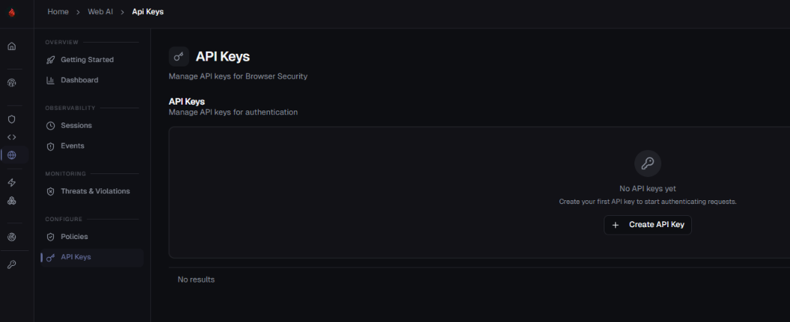
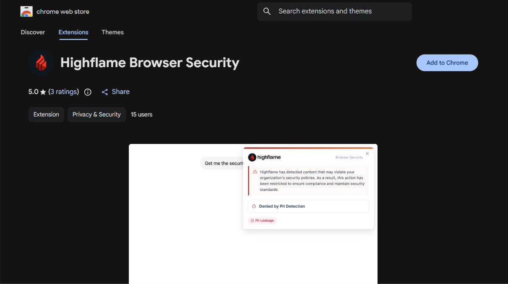

# Chrome Browser Security Setup

This guide explains how to install and connect **Highflame Browser Security** in
**Google Chrome**.

---

## Step 1 — Create a Highflame API Key

Sign in to **Highflame Studio**:

[https://studio.highflame.ai](https://studio.highflame.ai)

Go to:

**Web AI → API Keys → Create**



Create a service key. The value starts with:

```text
zid_sk_
```

Copy the key when it is created and store it securely. You will paste it into the
extension in Step 3.

> **Important:** Copy the key when it is created. Highflame does not show the full
> value again. Do not commit it to source control or share it through Slack/email.

---

## Step 2 — Install the Extension

Open the Chrome Web Store listing:

[Highflame Browser Security](https://chromewebstore.google.com/detail/highflame-browser-security/ilfhefflmhpdbnfhmmbbmfehbddbaobl)

Click:

```text
Add to Chrome
```



Confirm **Add extension**.

Pin the extension so Settings is easy to open:

```text
Chrome toolbar → puzzle-piece (Extensions) → pin Highflame Browser Security
```

## Step 3 — Connect the Extension

Click the **Highflame Browser Security** icon in the toolbar.

Click **Settings**.

Fill in:

```text
API Key:
zid_sk_<your key>

Shield Endpoint:
https://api.highflame.ai

Token Endpoint:
https://studio.highflame.ai/api/cli-auth/token
```

Click **Save**.

On success the popup shows **Saved successfully**, and the red banner on the main
view clears.

## Step 4 — Verify the Connection

In the extension popup, confirm:

```text
Red banner:
hidden

Version:
visible
```

If the banner still says to configure a valid API key, the token exchange failed.
Check the key, the Token Endpoint, and (for custom URLs) that host permission was
granted.

Then open a supported AI site and send a prompt:

```text
https://chatgpt.com
```
After that, check whether the session is visible.
**Web AI → Sessions/Events**

## Connector Configuration Summary

| Extension field | Value |
| --- | --- |
| **API Key** | Studio service key (`zid_sk_…`) |
| **Shield Endpoint** (SaaS) | `https://api.highflame.ai` |
| **Token Endpoint** (SaaS) | `https://studio.highflame.ai/api/cli-auth/token` |
| **Shield Endpoint** (self-hosted) | Your Shield base URL |
| **Token Endpoint** (self-hosted) | Your Studio `/api/cli-auth/token` URL |

---

## Security Notes

* Use a dedicated Studio service key for the browser extension.
* Never commit the API key to source control.
* Do not paste the key into Slack, email, or screenshots.
* Custom Shield and Token URLs must be `https://`.
* Grant host permission only for the Highflame hosts you intend to use.
* Rotate the key according to your organization's policy.
