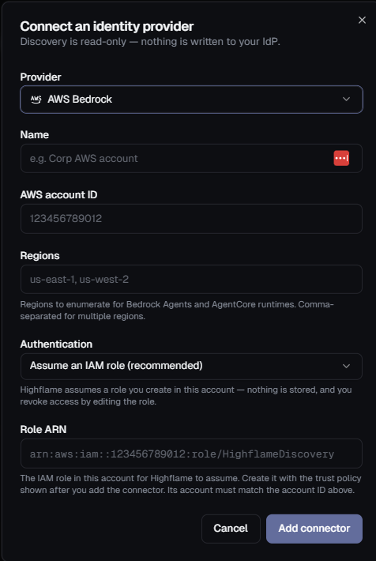
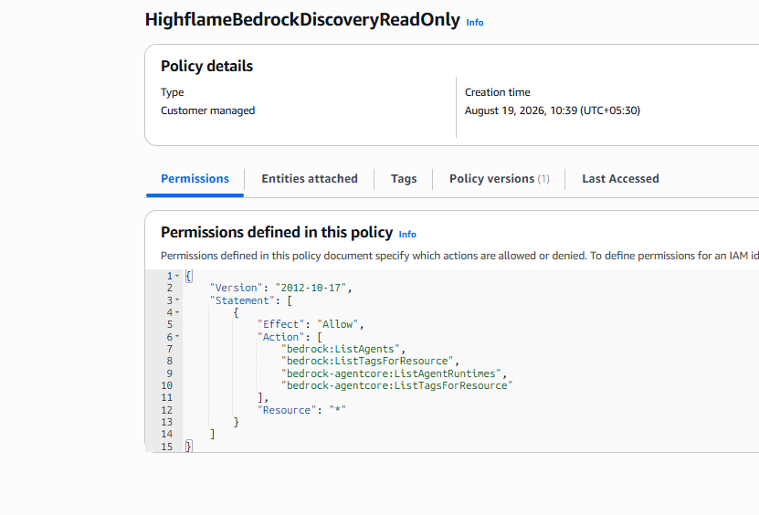
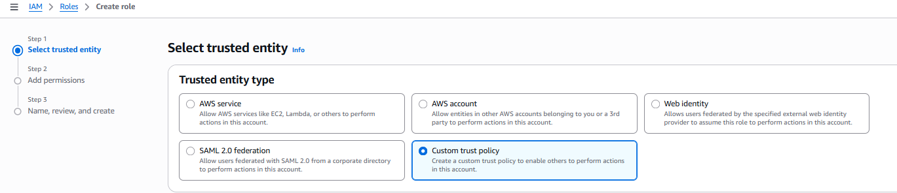
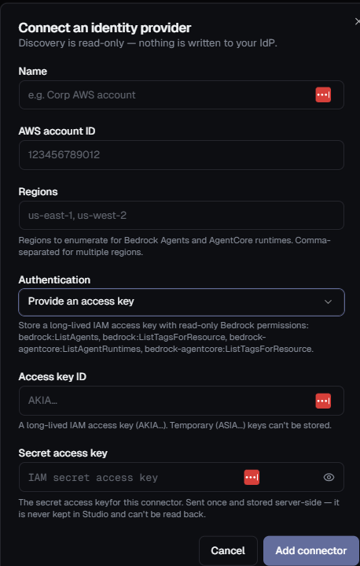

# AWS Bedrock Connector Setup

This guide explains how to configure **AWS Bedrock** for the Highflame Registry connector.



---

## Step 1 — Identify the Target AWS Account and Regions

Use the AWS account that contains the Bedrock Agents or AgentCore runtimes you want Highflame to discover.

You will need:

```text
AWS account ID:
<12-digit target account ID>

Regions:
us-east-1
```

Use the **12-digit AWS account ID**, not an account alias or ARN.

Bedrock resources are regional. Add every region that Highflame should enumerate, separated by commas:

```text
us-east-1,us-west-2
```

---

## Step 2 — Create the Read-Only Permissions Policy

In the target AWS account, go to:

**AWS Console → IAM → Policies → Create policy**

Open the **JSON** editor and paste:

```json
{
  "Version": "2012-10-17",
  "Statement": [
    {
      "Effect": "Allow",
      "Action": [
        "bedrock:ListAgents",
        "bedrock:ListTagsForResource",
        "bedrock-agentcore:ListAgentRuntimes",
        "bedrock-agentcore:ListTagsForResource"
      ],
      "Resource": "*"
    }
  ]
}
```
Recommended policy name:

Name the policy:

```text
HighflameBedrockDiscoveryReadOnly
```

Click **Create policy**.



These permissions allow Highflame to list Bedrock agents and AgentCore runtimes and read their tags. Resource tags such as `Owner`, `owner-email`, `managed-by`, or `created-by` can provide the accountable-owner signal in Highflame.

---

## Step 3 — Choose the Customer Role Name

Choose a role name, but do not create the role yet. Studio must first generate the connector-specific External ID used in the final trust policy.

Recommended role name:

```text
HighflameDiscovery
```

The planned role ARN is:

```text
arn:aws:iam::<TARGET-ACCOUNT-ID>:role/HighflameDiscovery
```

Replace `<TARGET-ACCOUNT-ID>` with the 12-digit account ID from Step 1.

---

## Step 4 — Add the Highflame Connector

Open:

**Highflame → Registry → Connections → Add Connector**

Select:

```text
Provider:
AWS Bedrock
```

Configure:

```text
Name:
<customer-defined connector name>

AWS account ID:
<12-digit target account ID>

Regions:
us-east-1

Authentication:
Assume an IAM role (recommended)

Role ARN:
arn:aws:iam::<TARGET-ACCOUNT-ID>:role/HighflameDiscovery
```

Click **Add connector**.

The role does not need to exist when the connector is added, but it must exist with the correct trust and permissions policies before the first sync.

After Studio creates the connector:

1. Copy the generated **External ID**.
2. Copy the Highflame discovery role ARN or the complete trust-policy snippet shown by Studio.
3. Do not sync yet.

> **Important:** Do not create or supply your own External ID. Studio generates a unique value for the connector.

---

## Step 5 — Create the Customer IAM Role

In the target AWS account, go to:

**AWS Console → IAM → Roles → Create role**

Select **Custom trust policy**.




Use the trust policy shown by Studio. Its shape is:

```json
{
  "Version": "2012-10-17",
  "Statement": [
    {
      "Effect": "Allow",
      "Principal": {
        "AWS": "<HIGHFLAME-DISCOVERY-ROLE-ARN-FROM-STUDIO>"
      },
      "Action": "sts:AssumeRole",
      "Condition": {
        "StringEquals": {
          "sts:ExternalId": "<EXTERNAL-ID-FROM-STUDIO>"
        }
      }
    }
  ]
}
```

Replace:

```text
<HIGHFLAME-DISCOVERY-ROLE-ARN-FROM-STUDIO>
```

with the Highflame discovery role ARN shown by Studio, and replace:

```text
<EXTERNAL-ID-FROM-STUDIO>
```

with the exact External ID generated for this connector.

Click **Next** and attach:

```text
HighflameBedrockDiscoveryReadOnly
```

Set the role name:

```text
HighflameDiscovery
```

Click **Create role**.

Verify that the resulting role ARN exactly matches the ARN entered in Studio:

```text
arn:aws:iam::<TARGET-ACCOUNT-ID>:role/HighflameDiscovery
```

---

## Step 6 — Sync and Verify Discovery

Return to the AWS Bedrock connector in Highflame and click:

**Sync**

Verify that:

```text
Last sync status:
Success
```

## Alternative — Authenticate with an Access Key

Use an access key only when cross-account role assumption is unavailable.



In the target AWS account:

1. Go to **IAM → Users → Create user**.
2. Create a dedicated user such as `highflame-discovery-key`.
3. Do not enable AWS Console access.
4. Attach `HighflameBedrockDiscoveryReadOnly`.
5. Open **Security credentials → Create access key**.
6. Choose **Application running outside AWS**.
7. Copy the Access Key ID and Secret Access Key.

In Studio, select:

```text
Authentication:
Provide an access key

Access key ID:
AKIA...

Secret access key:
<secret access key>
```

The account that owns the key must match the connector's AWS account ID.

> **Important:** Use a long-lived IAM-user key beginning with `AKIA`. Temporary STS keys beginning with `ASIA` are not supported.

The secret is write-only. Highflame stores it server-side and does not display it again.

---

## Connector Configuration Summary

| Highflame Field | AWS Value |
|---|---|
| **Provider** | AWS Bedrock |
| **Name** | Customer-defined name |
| **AWS account ID** | 12-digit target account ID |
| **Regions** | Regions containing Bedrock Agents or AgentCore runtimes |
| **Authentication (recommended)** | Assume an IAM role |
| **Role ARN** | `arn:aws:iam::<TARGET-ACCOUNT-ID>:role/HighflameDiscovery` |
| **External ID** | Generated by Studio; copied into the role trust policy |
| **Access-key fallback** | Dedicated long-lived `AKIA...` key and secret |

---

## Security Notes

* Prefer cross-account role assumption over a stored access key.
* Create the role and permissions policy in the target customer or sandbox account.
* Grant only the four read-only Bedrock discovery actions.
* Require the connector-specific `sts:ExternalId` in the role trust policy.
* Use only the Highflame discovery role ARN shown by Studio as the trust principal.
* Ensure the connector account ID matches the account containing the role or access key.
* Do not use Highflame's AWS account ID for a customer connector.
* Never commit an AWS access key or secret access key to source control.
* Revoke role-based access by editing or deleting the customer role.
